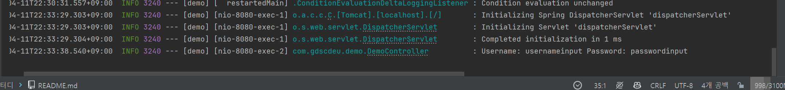

# 스프링부트 1주차 실습

## 스프링부트의 컨트룰러의 역할

- 사용자의 요청을 받아서 처리하고 응답을 하는 역할을 한다.
- 사용자의 요청을 받기 위해서는 @Controller 어노테이션을 사용한다.

## Web에서 자주 쓰이는 HTTP 요청 메소드

- GET : 데이터 조회
- POST : 데이터 추가

### @GetMapping

- GET 요청을 처리하는 어노테이션
- @GetMapping("/hello") : /hello 요청을 처리하는 메소드

### @PostMapping

- POST 요청을 처리하는 어노테이션
- @PostMapping("/hello") : /hello 요청을 처리하는 메소드

## 매개 변수

### @RequestParam

- 요청 파라미터를 받기 위한 어노테이션
- @RequestParam("name") String name : name이라는 파라미터를 받아서 name 변수에 저장

### @PathVariable

- URL 경로에 있는 값을 받기 위한 어노테이션
- @PathVariable("name") String name : /hello/{name}에서 name이라는 값을 받아서 name 변수에 저장

## 실습

