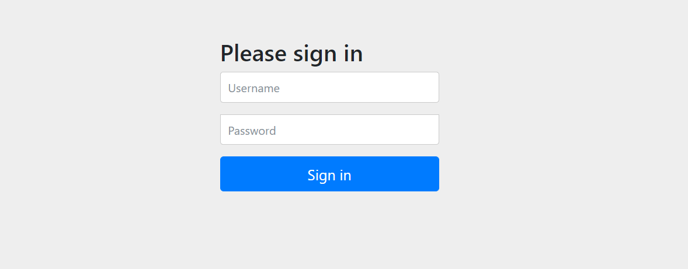

# 스프링 시큐리티 실습 예제

## 스프링 시큐리티 설정

### 1. 스프링 시큐리티 의존성 추가

스프링 시큐리티 의존성을 추가하게 되면 자동으로 스프링 시큐리티가 설정된다.

따라서 별도의 설정이 없으면 웹 페이지 접속 시 다음과 같은 화면이 나타난다.



### 2. 스프링 시큐리티 설정

스프링 시큐리티 설정을 하기 위해서는 `WebSecurityConfigurerAdapter` 클래스를 상속받은 클래스를 생성하고 `@Configuration` 어노테이션을 추가한다.

```java
@Configuration
@RequiredArgsConstructor
public class SecurityConfig {

    private final UserService userService;
    
    @Bean
    public SecurityFilterChain filterChain(HttpSecurity http) throws Exception {
        http
                .authorizeHttpRequests(authorize -> authorize
                        .requestMatchers("/auth/**").permitAll()
                        .anyRequest().authenticated()
                )
                .formLogin(formLogin -> formLogin
                        .loginPage("/auth/login")
                        .loginProcessingUrl("/auth/login")
                        .defaultSuccessUrl("/")
                        .permitAll()
                )
                .userDetailsService(userService);
        return http.build();
    }
}
```

위 코드에서 `SecurityFilterChain` 빈을 생성하고 `HttpSecurity` 객체를 이용하여 스프링 시큐리티 설정을 한다.

- `authorizeHttpRequests` 메소드를 이용하여 요청에 대한 권한을 설정한다.
- `formLogin` 메소드를 이용하여 로그인 페이지 설정을 한다.
- `userDetailsService` 메소드를 이용하여 사용자 정보를 조회하는 서비스를 설정한다.


### 3. 사용자 정보 조회 서비스 구현

사용자 정보를 조회하기 위한 서비스를 구현한다.

```java
@Controller
@RequestMapping("/user")
@RequiredArgsConstructor
public class UserController {

    private final UserService userService;

    @GetMapping
    public String user(Model model, Principal principal) {
        model.addAttribute("username", principal.getName());
        model.addAttribute("user", userService.findByUsername(principal.getName()));
        return "my-page";
    }
}
```

위 코드에서 `Principal` 객체를 이용하여 로그인한 사용자 정보를 조회할 수 있다.
